# Penyelesaian Tugas TCP UDP Wireshark Jaringan Komputer D
Nama    : Arif Nugraha Santosa </br>
NRP     : 5025211048 </br>
Kelas   : Jaringan Komputer D </br>

## Pembahasan Soal TCP

### Soal 1
What is the IP address and TCP port number used by the client computer (source) that is transferring the alice.txt file to gaia.cs.umass.edu? To answer this question, it’s probably easiest to select an HTTP message and explore the details of the TCP packet used to carry this HTTP message, using the “details of the selected packet header window” (refer to Figure 2 in the “Getting Started with Wireshark” Lab if you’re uncertain about the Wireshark windows).

### Jawaban Soal 1

```
Source Address: 192.168.86.68
Source Port: 55639
```

### Soal 2
What is the IP address of gaia.cs.umass.edu? On what port number is it sending and receiving TCP segments for this connection?

### Jawaban Soal 2
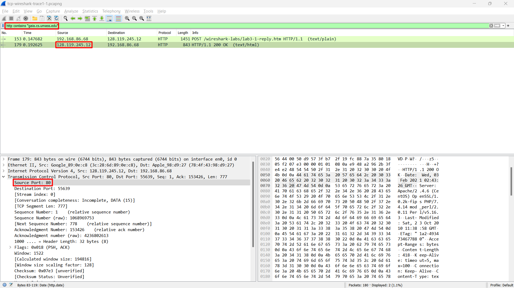
```
Source Address: 128.119.245.12
Source Port: 80
```

### Soal 3
What is the sequence number of the TCP SYN segment that is used to initiate the TCP connection between the client computer and gaia.cs.umass.edu? (Note: this is the “raw” sequence number carried in the TCP segment itself; it is NOT the packet # in the “No.” column in the Wireshark window. Remember there is no such thing as a “packet number” in TCP or UDP; as you know, there are sequence numbers in TCP and that’s what we’re after here. Also note that this is not the relative sequence number with respect to the starting sequence number of this TCP session.). What is it in this TCP segment that identifies the segment as a SYN segment? Will the TCP receiver in this session be able to use Selective Acknowledgments (allowing TCP to function a bit more like a “selective repeat” receiver, see section 3.4.5 in the text)?

### Jawaban Soal 3
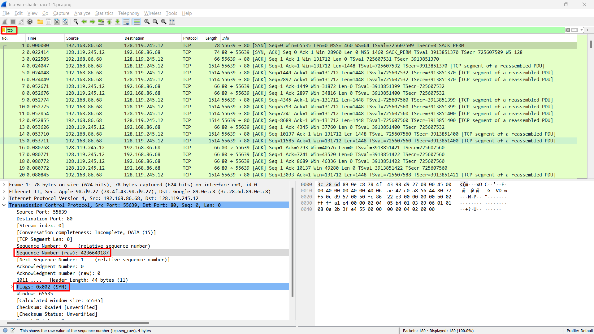
```
Sequence Number (raw): 4236649187
Flags: 0x002 (SYN)
```

### Soal 4
What is the sequence number of the SYNACK segment sent by gaia.cs.umass.edu to the client computer in reply to the SYN? What is it in the segment that identifies the segment as a SYNACK segment? What is the value of theAcknowledgementfield in the SYNACK segment? How did gaia.cs.umass.edu determine that value?

### Jawaban Soal 4
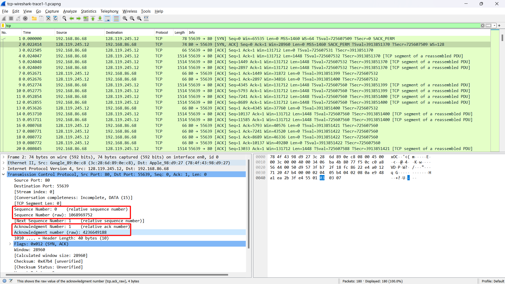
```
Sequence Number: 0    (relative sequence number)
Sequence Number (raw): 1068969752
Acknowledgment Number: 1    (relative ack number)
Acknowledgment number (raw): 4236649188
```
__Acknowledgment number didapat dari Sequence Number ada SYN segment yang ditambah 1.__

### Soal 5
What is the sequence number of the TCP segment containing the header of the HTTP POST command? How many bytes of data are contained in the payload (data) field of this TCP segment? Did all of the data in the transferred file alice.txt fit into this single segment?

### Jawaban Soal 5
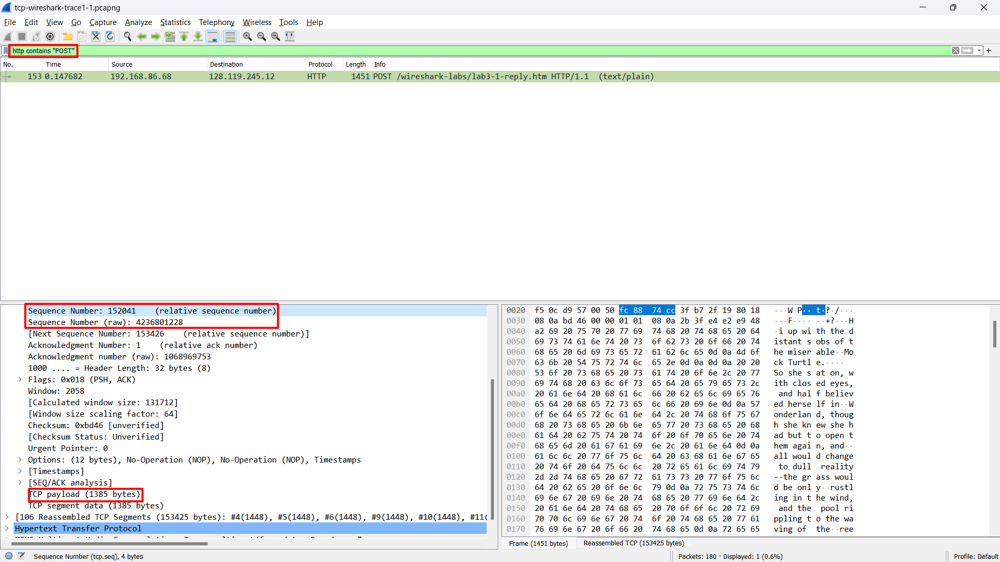
```
Sequence Number: 152041    (relative sequence number)
Sequence Number (raw): 4236801228
TCP payload (1385 bytes)
```
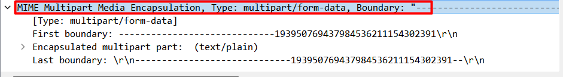
```
File alice.txt tidak langsung dikirimkan dalam single segment karena segment tersebut menggunakan MIME Multipart Media Encapsulation.
```


### Soal 6
Consider the TCP segment containing the HTTP “POST” as the first segment in the data transfer part of the TCP connection. 
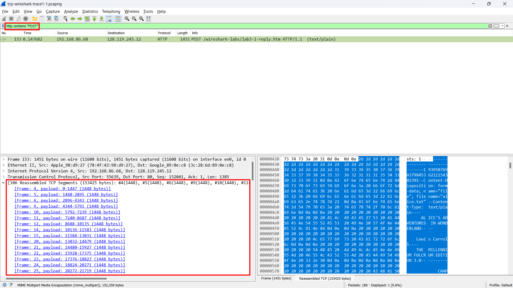

### Jawaban Soal 6
- At what time was the first segment (the one containing the HTTP POST) in the data-transfer part of the TCP connection sent?
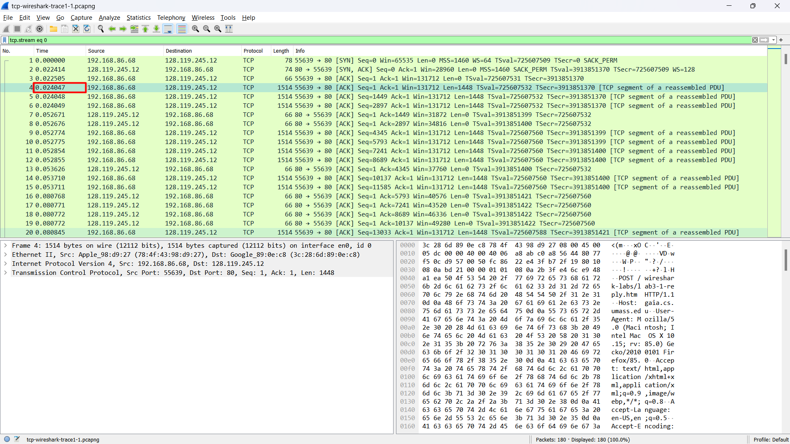
```
Frame 4 = 0.024047 sec
```
- At what time was the ACK for this first data-containing segment received?

__Frame ke-4 mengirimkan packet yang diterima pada frame ke-7.__
```
Frame 7	= 0.052671 sec
```
- What is the RTT for this first data-containing segment?
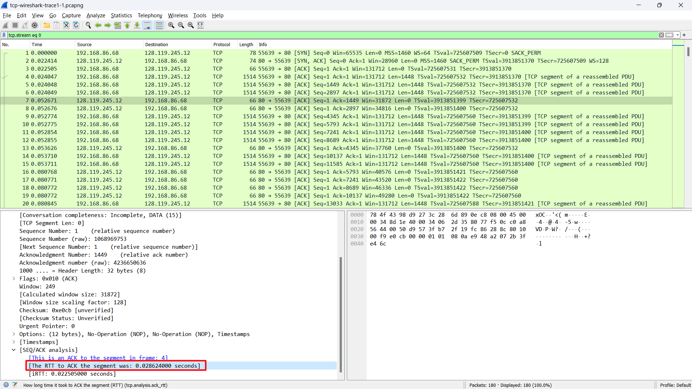
```
The RTT to ACK the segment was: 0.028624000 seconds
```
- What is the RTT value the second data-carrying TCP segment and its ACK?
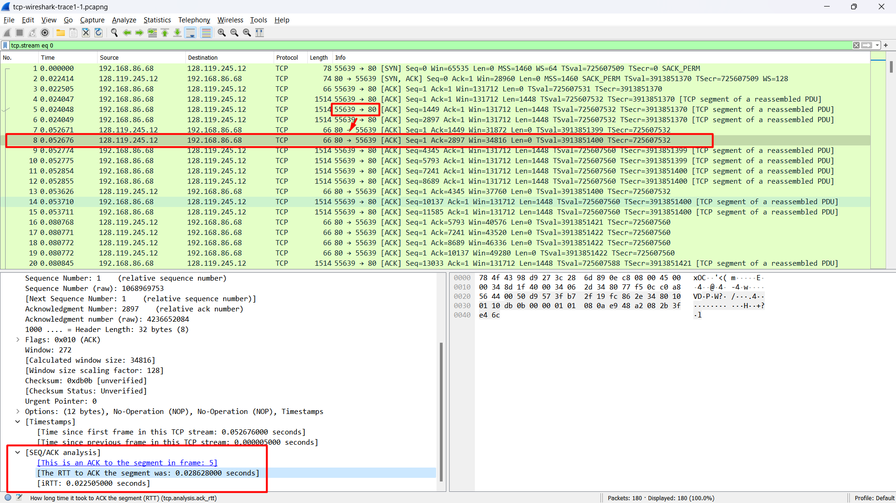
__Frame ke-5 (Segment ke-2) mengirimkan packet yang diterima pada frame ke-8.__
```
The RTT to ACK the segment was: 0.028628000 seconds
```
- What is the EstimatedRTT value (see Section 3.5.3, in the text) after the ACK for the second data-carrying segment is received? Assume that in 
making this calculation after the received of the ACK for the second segment, that the initial value of EstimatedRTT is equal to the measured RTT for the first segment, and then is computed using the EstimatedRTT equation on page 242, and a value of  = 0.125.
```
Agak rumit...
```

### Soal 7
What is the length (header plus payload) of each of the first four data-carrying TCP segments?

### Jawaban Soal 7
Berikut adalah 4 paket yang men-carry TCP segments yaitu Frame 4, 5, 6, 9

- Frame 4
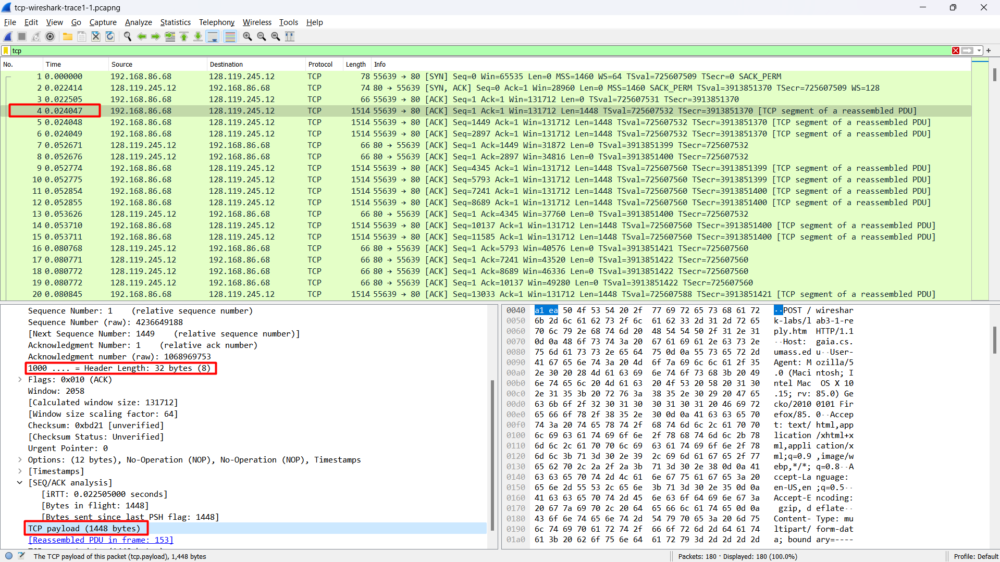
```
Frame 4: Header Length: 32 bytes + TCP payload: 1448 bytes = 1480 bytes
```
- Frame 5
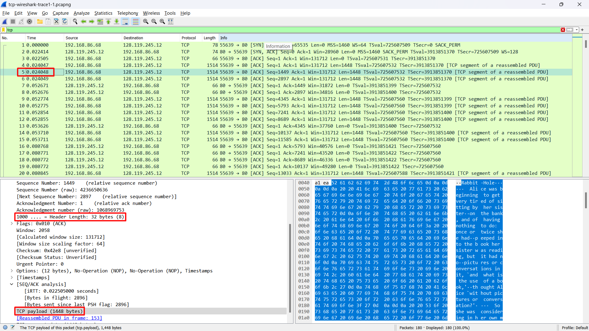
```
Frame 5: Header Length: 32 bytes + TCP payload: 1448 bytes = 1480 bytes
```
- Frame 6

```
Frame 6: Header Length: 32 bytes + TCP payload: 1448 bytes = 1480 bytes
```
- Frame 9
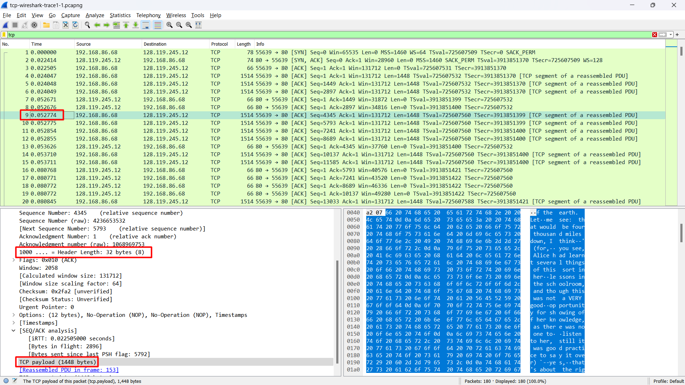
```
Frame 9: Header Length: 32 bytes + TCP payload: 1448 bytes = 1480 bytes
```
Total
```
Frame 4: Header Length: 32 bytes + TCP payload: 1448 bytes = 1480 bytes
Frame 5: Header Length: 32 bytes + TCP payload: 1448 bytes = 1480 bytes
Frame 6: Header Length: 32 bytes + TCP payload: 1448 bytes = 1480 bytes
Frame 9: Header Length: 32 bytes + TCP payload: 1448 bytes = 1480 bytes
Total = 5920 bytes
```

### Soal 8
What is the minimum amount of available buffer space advertised to the client by gaia.cs.umass.edu among these first four data-carrying TCP segments? Does the lack of receiver buffer space ever throttle the sender for these first four data-carrying segments?

### Jawaban Soal 8
first four data-carrying TCP segments adalah (sama seperti no. 7)

__Note: Untuk melihat minimum amount of available buffer space dapat melalui informasi "Window" pada tiap frame yang mengandung TCP segments.__
- Frame 4
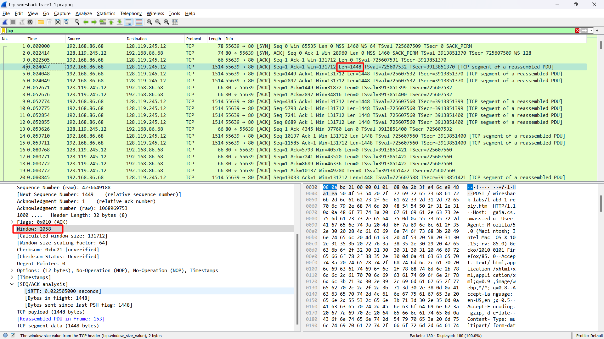
```
Window: 2058
Length: 1448 bytes
```
- Frame 5
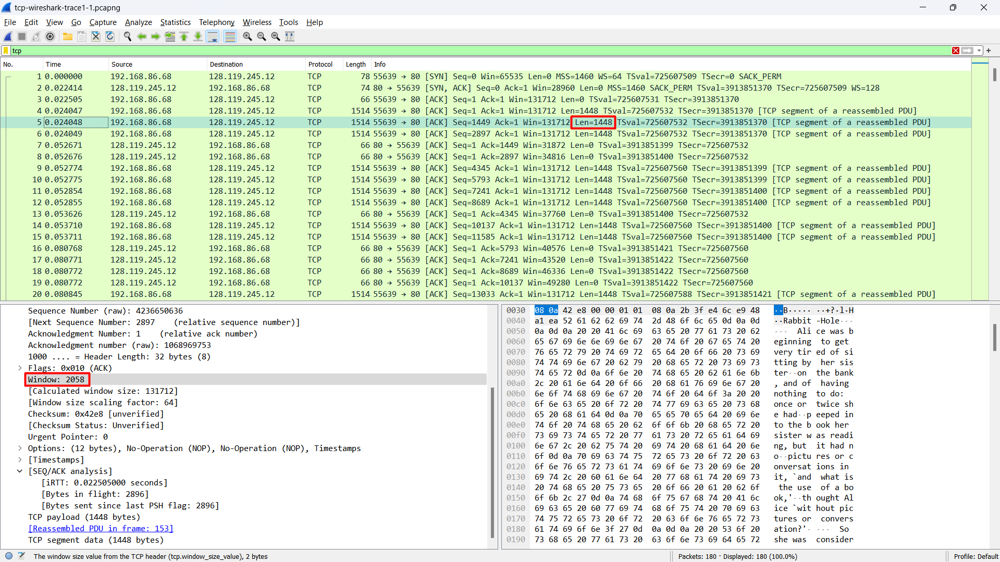
```
Window: 2058
Length: 1448 bytes
```
- Frame 6
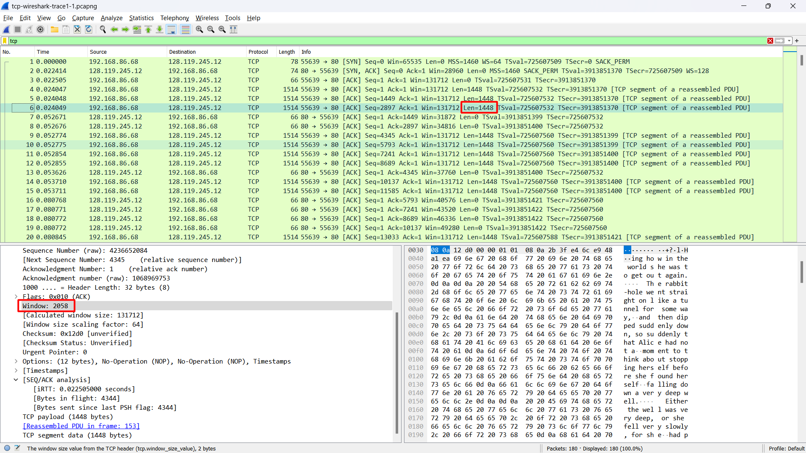
```
Window: 2058
Length: 1448 bytes
```
- Frame 9
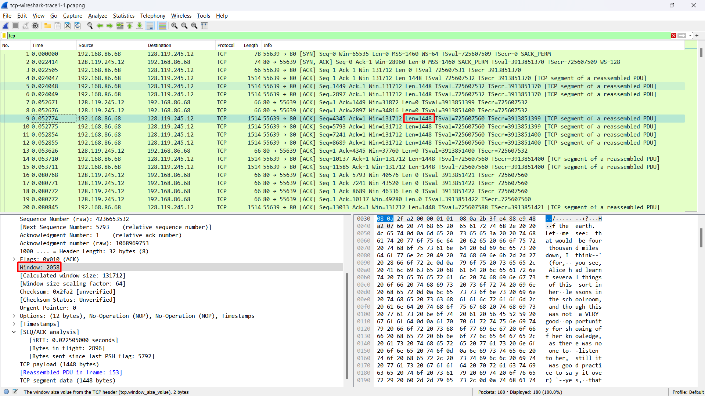
```
Window: 2058
Length: 1448 bytes
```
```
Receiver buffer space tidak mengalami throttle karena Window size > Length segment yang dikirimkan.
```
### Soal 9 - 14
`OTW`

## Pembahasan Soal UDP
