# Penyelesaian Tugas TCP UDP Wireshark Jaringan Komputer D
Nama    : Arif Nugraha Santosa </br>
NRP     : 5025211048 </br>
Kelas   : Jaringan Komputer D </br>

## Pembahasan Soal TCP

### Soal 1
What is the IP address and TCP port number used by the client computer (source) that is transferring the alice.txt file to gaia.cs.umass.edu? To answer this question, it’s probably easiest to select an HTTP message and explore the details of the TCP packet used to carry this HTTP message, using the “details of the selected packet header window” (refer to Figure 2 in the “Getting Started with Wireshark” Lab if you’re uncertain about the Wireshark windows).

### Jawaban Soal 1

```
Source Address: 192.168.86.68
Source Port: 55639
```

### Soal 2
What is the IP address of gaia.cs.umass.edu? On what port number is it sending and receiving TCP segments for this connection?

### Jawaban Soal 2

```
Source Address: 128.119.245.12
Source Port: 80
```

### Soal 3
What is the sequence number of the TCP SYN segment that is used to initiate the TCP connection between the client computer and gaia.cs.umass.edu? (Note: this is the “raw” sequence number carried in the TCP segment itself; it is NOT the packet # in the “No.” column in the Wireshark window. Remember there is no such thing as a “packet number” in TCP or UDP; as you know, there are sequence numbers in TCP and that’s what we’re after here. Also note that this is not the relative sequence number with respect to the starting sequence number of this TCP session.). What is it in this TCP segment that identifies the segment as a SYN segment? Will the TCP receiver in this session be able to use Selective Acknowledgments (allowing TCP to function a bit more like a “selective repeat” receiver, see section 3.4.5 in the text)?

### Jawaban Soal 3

```
Sequence Number (raw): 4236649187
Flags: 0x002 (SYN)
```

### Soal 4
What is the sequence number of the SYNACK segment sent by gaia.cs.umass.edu to the client computer in reply to the SYN? What is it in the segment that identifies the segment as a SYNACK segment? What is the value of theAcknowledgementfield in the SYNACK segment? How did gaia.cs.umass.edu determine that value?

### Jawaban Soal 4

```
Sequence Number: 0    (relative sequence number)
Sequence Number (raw): 1068969752
Acknowledgment Number: 1    (relative ack number)
Acknowledgment number (raw): 4236649188
```
__Acknowledgment number didapat dari Sequence Number ada SYN segment yang ditambah 1.__

### Soal 5
What is the sequence number of the TCP segment containing the header of the HTTP POST command? How many bytes of data are contained in the payload (data) field of this TCP segment? Did all of the data in the transferred file alice.txt fit into this single segment?

### Jawaban Soal 5

```
Sequence Number: 152041    (relative sequence number)
Sequence Number (raw): 4236801228
TCP payload (1385 bytes)
```

```
File alice.txt tidak langsung dikirimkan dalam single segment karena segment tersebut menggunakan MIME Multipart Media Encapsulation.
```


### Soal 6
Consider the TCP segment containing the HTTP “POST” as the first segment in the data transfer part of the TCP connection. 


### Jawaban Soal 6
- At what time was the first segment (the one containing the HTTP POST) in the data-transfer part of the TCP connection sent?

```
Frame 4 = 0.024047 sec
```
- At what time was the ACK for this first data-containing segment received?
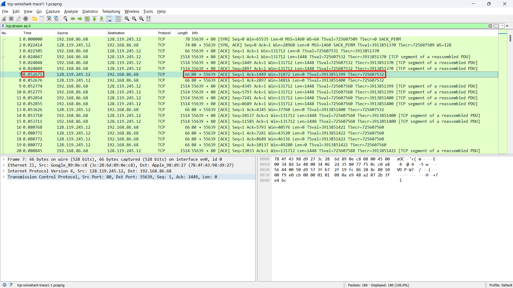
__Frame ke-4 mengirimkan packet yang diterima pada frame ke-7.__
```
Frame 7	= 0.052671 sec
```
- What is the RTT for this first data-containing segment?

```
The RTT to ACK the segment was: 0.028624000 seconds
```
- What is the RTT value the second data-carrying TCP segment and its ACK?

__Frame ke-5 (Segment ke-2) mengirimkan packet yang diterima pada frame ke-8.__
```
The RTT to ACK the segment was: 0.028628000 seconds
```
- What is the EstimatedRTT value (see Section 3.5.3, in the text) after the ACK for the second data-carrying segment is received? Assume that in 
making this calculation after the received of the ACK for the second segment, that the initial value of EstimatedRTT is equal to the measured RTT for the first segment, and then is computed using the EstimatedRTT equation on page 242, and a value of  = 0.125.
```
Agak rumit...
```

### Soal 7
What is the length (header plus payload) of each of the first four data-carrying TCP segments?

### Jawaban Soal 7
Berikut adalah 4 paket yang men-carry TCP segments yaitu Frame 4, 5, 6, 9
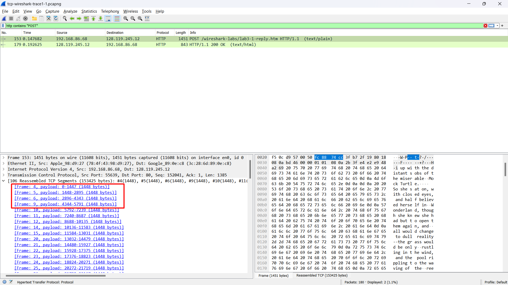
- Frame 4

```
Frame 4: Header Length: 32 bytes + TCP payload: 1448 bytes = 1480 bytes
```
- Frame 5

```
Frame 5: Header Length: 32 bytes + TCP payload: 1448 bytes = 1480 bytes
```
- Frame 6

```
Frame 6: Header Length: 32 bytes + TCP payload: 1448 bytes = 1480 bytes
```
- Frame 9

```
Frame 9: Header Length: 32 bytes + TCP payload: 1448 bytes = 1480 bytes
```
Total
```
Frame 4: Header Length: 32 bytes + TCP payload: 1448 bytes = 1480 bytes
Frame 5: Header Length: 32 bytes + TCP payload: 1448 bytes = 1480 bytes
Frame 6: Header Length: 32 bytes + TCP payload: 1448 bytes = 1480 bytes
Frame 9: Header Length: 32 bytes + TCP payload: 1448 bytes = 1480 bytes
Total = 5920 bytes
```

### Soal 8
What is the minimum amount of available buffer space advertised to the client by gaia.cs.umass.edu among these first four data-carrying TCP segments? Does the lack of receiver buffer space ever throttle the sender for these first four data-carrying segments?

### Jawaban Soal 8
first four data-carrying TCP segments adalah (sama seperti no. 7)

__Note: Untuk melihat minimum amount of available buffer space dapat melalui informasi "Window" pada tiap frame yang mengandung TCP segments.__
- Frame 4

```
Window: 2058
Length: 1448 bytes
```
- Frame 5

```
Window: 2058
Length: 1448 bytes
```
- Frame 6

```
Window: 2058
Length: 1448 bytes
```
- Frame 9

```
Window: 2058
Length: 1448 bytes
```
```
Receiver buffer space tidak mengalami throttle karena Window size > Length segment yang dikirimkan.
```
### Soal 9 - 14
`OTW`

## Pembahasan Soal UDP

### Soal 1
Select the first UDP segment in your trace. What is the packet number4 of this segment in the trace file? What type of application-layer payload or protocol message is being carried in this UDP segment? Look at the details of this packet in Wireshark. How many fields there are in the UDP header? (You shouldn’t look in the textbook! Answer these questions directly from what you observe in the packet trace.) What are the names of these fields?

### Jawaban Soal 1
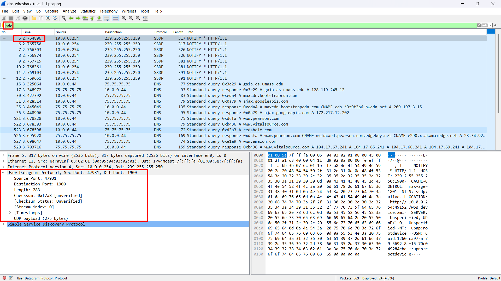
```
Application-layer payload or protocol message: SSDP
Fields: 4 yang terdiri dari
> Source Port: 47931
> Destination Port: 1900
> Length: 283
> Checksum: 0xf7a8 [unverified]
```

### Soal 2
By consulting the displayed information in Wireshark’s packet content field for this packet (or by consulting the textbook), what is the length (in bytes) of each of the UDP header fields?

### Jawaban Soal 2
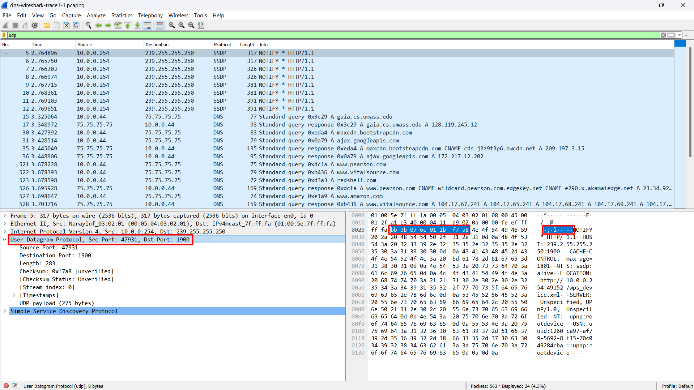
```
Pada frame no.5, dapat disimpulkan:
UDP header memiliki panjang 8 bytes.
Setiap UDP header fields memiliki panjang 2 bytes (memiliki 4 fields yang masing-masing berukuran 2 bytes).
```
Berikut adalah detailnya:
- Source Port (2 bytes)
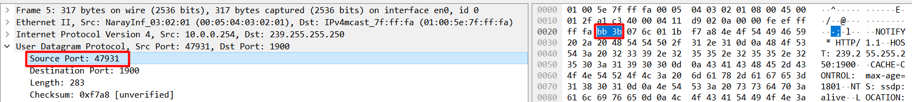
- Destination Port (2 bytes)
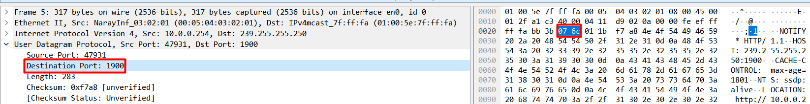
- Length (2 bytes)
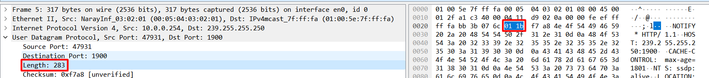
- Checksum (2 bytes)
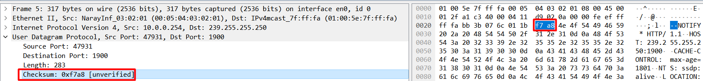

### Soal 3
The value in the Length field is the length of what? (You can consult the text for this answer). Verify your claim with your captured UDP packet. 

### Jawaban Soal 3
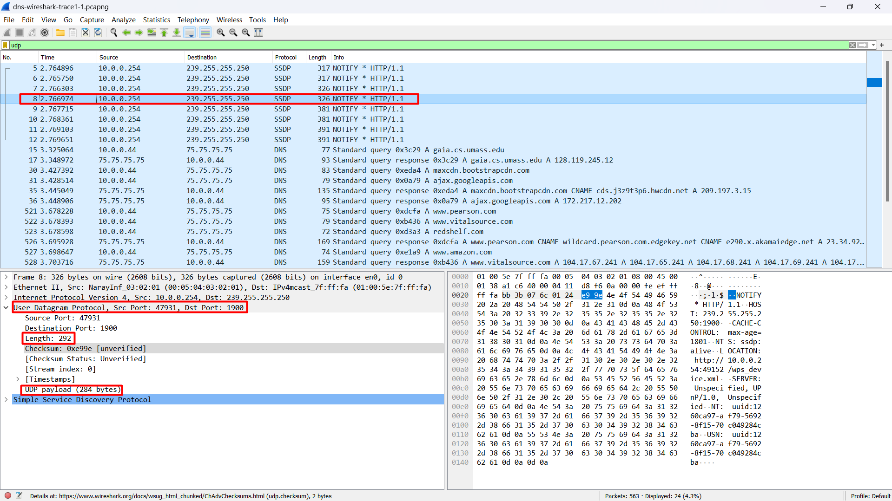
```
Field "Length" merupakan panjang dalam bytes dari segmen UDP (User Datagram Protocol)

Length didapatkan melalui "UDP header + UDP payload".

Misalkan dalam frame di atas, memiliki:
Length: 292 bytes
UDP payload: 284 bytes
UDP header: 8 bytes (seperti pada soal no. 2)

Maka 292 bytes = 284 bytes + 8 bytes
```

### Soal 4
What is the maximum number of bytes that can be included in a UDP payload? (Hint: the answer to this question can be determined by your answer to 2. above)

### Jawaban Soal 4
```
Jumlah maksimum bytes yang dapat dimasukkan dalam UDP payload adalah (2^16 - 1) bytes ditambah header bytes (8 bytes).

Maka jumlah maksimum bytes yang dapat dimasukkan dalam UDP payload adalah 65535 bytes - 8 bytes = 65527 bytes.
```

### Soal 5
What is the largest possible source port number? (Hint: see the hint in 4.)

### Jawaban Soal 5
```
Kemungkinan source port number terbesar adalah (2^16 - 1) bytes yaitu 65535 bytes.
```

### Soal 6
What is the protocol number for UDP? Give your answer in decimal notation. To answer this question, you’ll need to look into the Protocol field of the IP datagram containing this UDP segment (see Figure 4.13 in the text, and the discussion of IP header fields). 

### Jawaban Soal 6
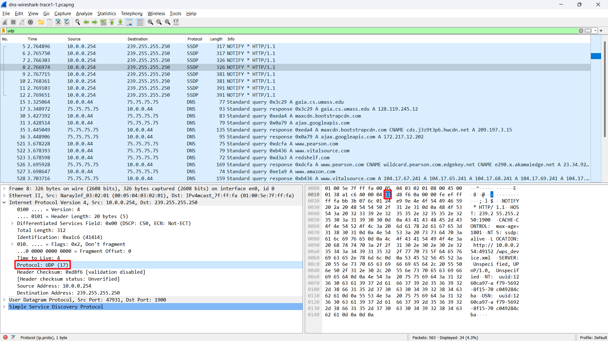
```
Nomor protocol untuk UDP adalah 11(hexadecimal) yang apabila dikonversikan ke decimal menjadi 17(decimal).
```

### Soal 7
Examine the pair of UDP packets in which your host sends the first UDP packet and the second UDP packet is a reply to this first UDP packet. (Hint: for a second packet to be sent in response to a first packet, the sender of the first packet should be the destination of the second packet). What is the packet number of the first of these two UDP segments in the trace file? What is the packet number of the second of these two UDP segments in the trace file? Describe the relationship  between the port numbers in the two packets.

### Jawaban Soal 7
Kita dapat menentukan frame paket yang mengirim melalui kolom `info` atau mengecek `port` yang digunakan, misalkan saya memiliki frame no. 15 (sender) dan no. 17 (response)
</br>
</br>
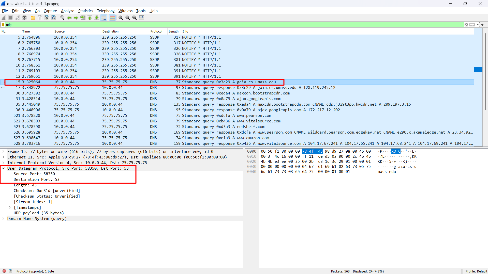
```
Frame 15 (Sender):
Source Port: 58350
Destination Port: 53
```
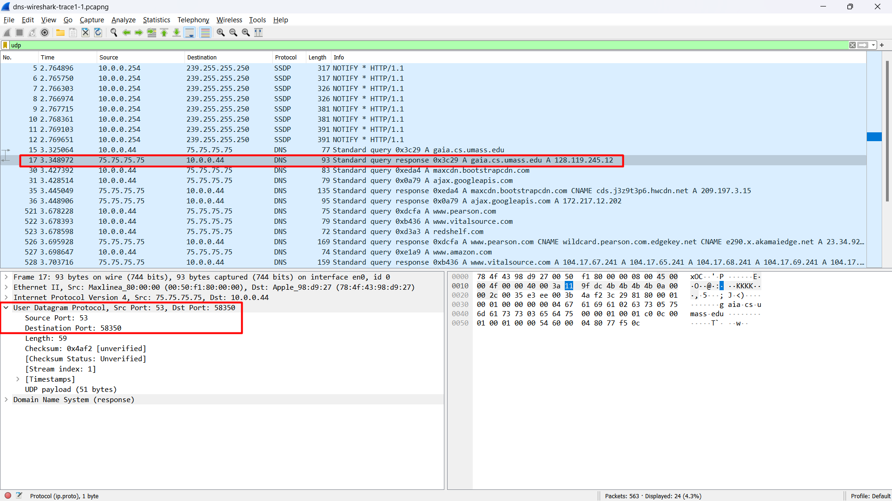
```
Frame 17 (Receiver):
Source Port: 53
Destination Port: 58350
```
```
Relasi antara kedua port number dari paket tersebut adalah Source Port dari sender sama dengan Destination Port dari receiver. Kemudian Destination Port dari sender sama dengan Source Port dari receiver.
```

### THANK U! 😄